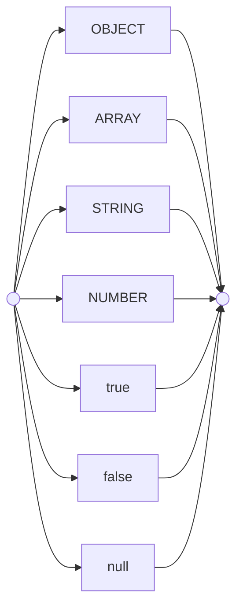
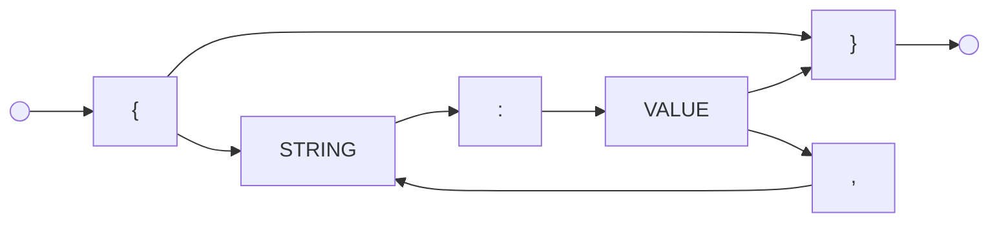
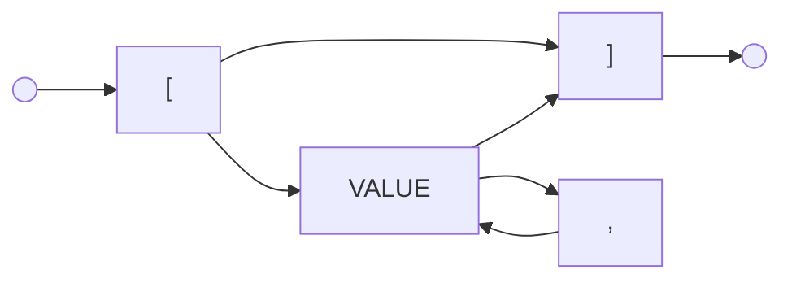
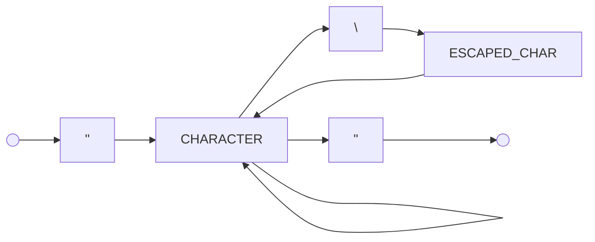
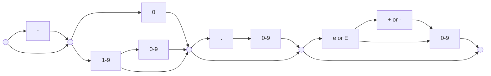
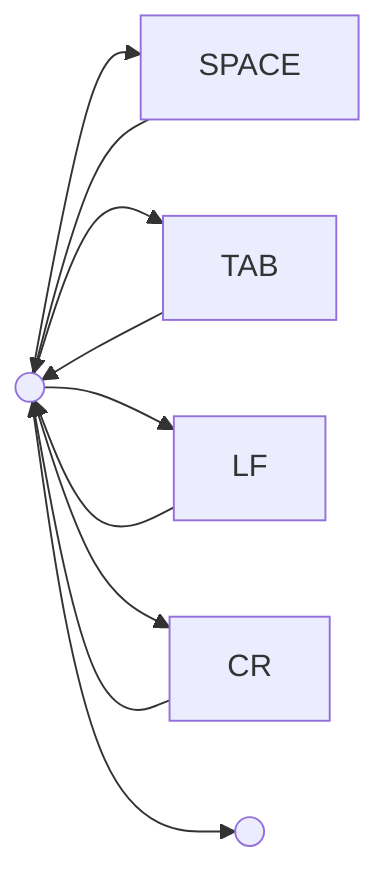

# JSON Grammar Reference

This document provides a visual guide to the JSON grammar, using tokens that match the `TokenType` enum.

## 1. Visual Guide Key

### Diagram Shapes

| Shape          | Meaning                                                     |
| :------------- | :---------------------------------------------------------- |
| `(( ))`        | Start or End of a grammar production                        |
| `[TOKEN]`      | A token emitted by the lexer (e.g., `STRING`, `NUMBER`)     |
| `["char"]`     | A literal character expected in the input (e.g., `{`, `"`)  |
| `-->`          | The path the scanner takes through the characters           |
| `-- label -->` | A specific condition or branch in the flow                  |

### Token Mnemonics

| Mnemonic   | TokenType                   | Literal Character(s) |
| :--------- | :-------------------------- | :------------------- |
| `LBRACE`   | `TokenType.LBRACE`          | `{`                  |
| `RBRACE`   | `TokenType.RBRACE`          | `}`                  |
| `LBRACKET` | `TokenType.LBRACKET`        | `[`                  |
| `RBRACKET` | `TokenType.RBRACKET`        | `]`                  |
| `COLON`    | `TokenType.COLON`           | `:`                  |
| `COMMA`    | `TokenType.COMMA`           | `,`                  |
| `QUOTE`    | `TokenType.STRING` (Marker) | `"`                  |
| `TRUE`     | `TokenType.TRUE`            | `true`               |
| `FALSE`    | `TokenType.FALSE`           | `false`              |
| `NULL`     | `TokenType.NULL`            | `null`               |

## 2. Formal Grammar (EBNF)

A JSON text is a single value, optionally surrounded by whitespace.

```text
json    = element ;
```

Values can be complex containers or primitive types.

```text
element = ws value ws ;
value   = object | array | string | number | bool | null ;
```

Objects are collections of key-value pairs separated by commas.

```text
object  = "{" ( ws | member ( "," member )* ) "}" ;
member  = string ws ":" element ;
```

Arrays are ordered lists of values.

```text
array   = "[" ( ws | element ( "," element )* ) "]" ;
```

Strings consist of characters inside double quotes.

```text
string  = '"' char* '"' ;
char    = [^"\\]
        | "\" ( ["\/bfnrt] | "u" [0-9a-fA-F]{4} ) ;
```

Numbers follow scientific notation rules.

```text
number  = [ "-" ] int [ frac ] [ exp ] ;
int     = "0" | [1-9] [0-9]* ;
frac    = "." [0-9]+ ;
exp     = [eE] [ "+" | "-" ] [0-9]+ ;
```

Primitives.

```text
bool    = "true" | "false" ;
null    = "null" ;
```

Whitespace: Space, Horizontal Tab, Line Feed, or Carriage Return.

```text
ws      = [ \x20 \t \n \r ]* ;
```

## 3. VALUE

A JSON value can be an object, array, string, number, or one of the three literals.



## 4. OBJECT

An object is an unordered set of name/value pairs.



## 5. ARRAY

An array is an ordered collection of values.



## 6. STRING

A string is a sequence of zero or more Unicode characters, wrapped in double quotes.



## 7. NUMBER

A number is very much like a C or Java number, except that the octal and hexadecimal formats are not used.



## 8. WHITESPACE

Whitespace can be inserted between any pair of tokens.


