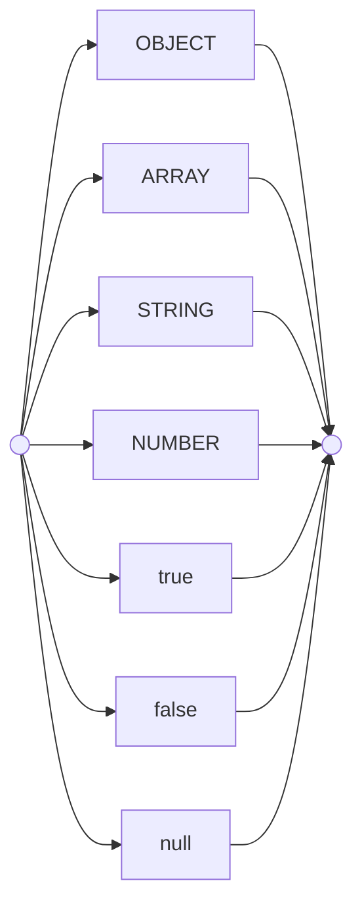
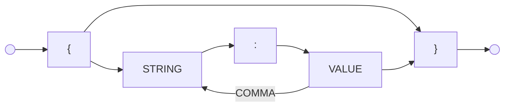
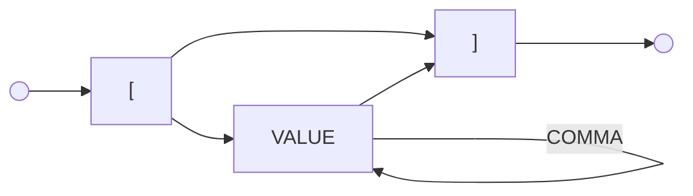
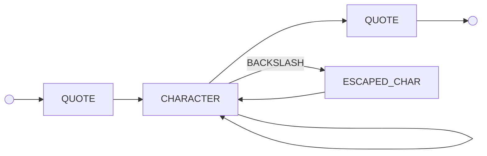
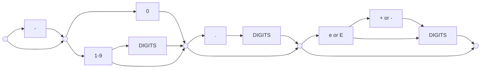
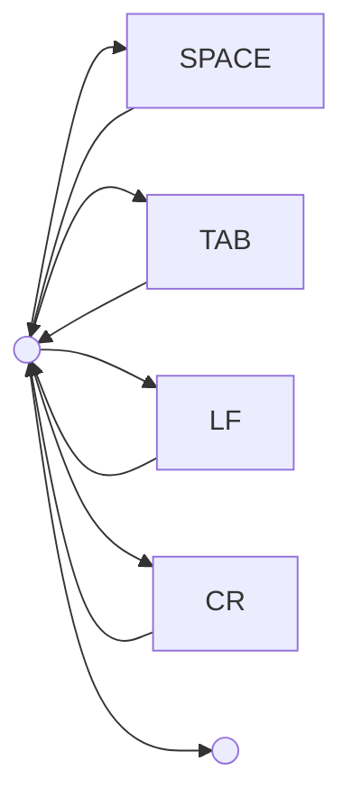

# JSON Grammar Reference

This document provides a visual guide to the JSON grammar, using tokens that match the `TokenType` enum.

## 1. Key

### Diagram Shapes

| Shape          | Meaning                                                     |
| :------------- | :---------------------------------------------------------- |
| `(( ))`        | Start or End of a grammar production                        |
| `[TOKEN]`      | A token emitted by the lexer (e.g., `STRING`, `NUMBER`)     |
| `["char"]`     | A literal character expected in the input (e.g., `{`, `"`)  |
| `-->`          | The path the scanner takes through the characters           |
| `-- label -->` | A specific condition or branch in the flow                  |

### Token Mnemonics

| Mnemonic   | TokenType                   | Literal Character(s) |
| :--------- | :-------------------------- | :------------------- |
| `LBRACE`   | `TokenType.LBRACE`          | `{`                  |
| `RBRACE`   | `TokenType.RBRACE`          | `}`                  |
| `LBRACKET` | `TokenType.LBRACKET`        | `[`                  |
| `RBRACKET` | `TokenType.RBRACKET`        | `]`                  |
| `COLON`    | `TokenType.COLON`           | `:`                  |
| `COMMA`    | `TokenType.COMMA`           | `,`                  |
| `QUOTE`    | `TokenType.STRING` (Marker) | `"`                  |
| `TRUE`     | `TokenType.TRUE`            | `true`               |
| `FALSE`    | `TokenType.FALSE`           | `false`              |
| `NULL`     | `TokenType.NULL`            | `null`               |

## 2. VALUE

A JSON value can be an object, array, string, number, or one of the three literals.

## 3. OBJECT

An object is an unordered set of name/value pairs.

## 4. ARRAY

An array is an ordered collection of values.

## 5. STRING

A string is a sequence of zero or more Unicode characters, wrapped in double quotes.

## 6. NUMBER

A number is very much like a C or Java number, except that the octal and hexadecimal formats are not used.

## 7. WHITESPACE

Whitespace can be inserted between any pair of tokens.

